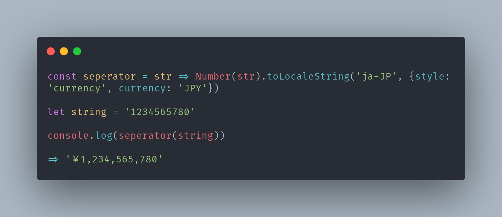

자바스크립트로 천단위마다 콤마를 찍는 세가지 방법!

## 1. 정규식으로 사용하기

```js
const currency = num.toString().replace(/\B(?=(\d{3})+(?!\d))/g, ',')
```

## 2. .toLocaleString() 사용하기

```js
Number.prototype.toLocaleString()
```

[Number이외에도 객채나 날짜, 배열에도 적용가능하다. ](https://developer.mozilla.org/ko/docs/Web/JavaScript/Reference/Global_Objects/Array/toLocaleString)

`toLocaleString()`이란 특정 자료가 들어왔을 때 설정해놓은 지역에서 읽는 형태로 바꿔주는 함수이다. 내가 currency type을 일본으로 설정하면 표기가 엔화로 자동적으로 바뀌는 식이다.



## 3. Intl.NumberFormat

```js
var number = 123456.789

console.log(new Intl.NumberFormat().format(number))
// → 한국 로케일의 경우 '123,456.789' 표시

// 통화 서식
console.log(
  new Intl.NumberFormat('de-DE', { style: 'currency', currency: 'EUR' }).format(
    number
  )
)
// → 123.456,79 €

// 한국 원화는 보조 통화 단위를 사용하지 않음
console.log(
  new Intl.NumberFormat('ko-KR', { style: 'currency', currency: 'KRW' }).format(
    number
  )
)
// → ₩123,457

// 유효숫자를 세 개로 제한
console.log(
  new Intl.NumberFormat('en-IN', { maximumSignificantDigits: 3 }).format(number)
)
// → 1,23,000
```

위처럼 옵션을 걸어서 통화 서식을 바꿀 수도 있고, 유효숫자의 수도 조절할 수 있다.
