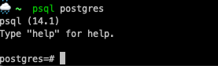
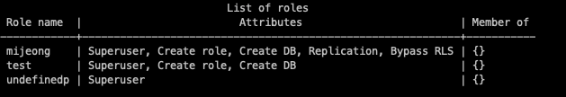

macOS기반에서 PostgreSQL을 설치하고, db관리툴인 dbeaver과 연동까지 해보자!

처음으로 맥에서 postgrSQL 세팅하면서 있었던 우당탕탕얼레벌레 어 왜 안돼???? 두번은 겪기 싫어서 정리하기

## 1. postgreSQL 설치

#### 설치

```bash
brew install postgresql
```

#### 서비스 시작

```bash
brew service start postgresql
```

#### 버전 확인

```
postgres -V
```

<p>
<center>
    
    <em>버전 확인</em>
</center>
</p>

이런식으로 버전이 잘 확인되면 설치는 끝났다!

## 2. postgreSQL 설정

놀랍게도 postgreSql은 알아서 설치할 때 계정을 생성해준다. 얼라리 어어랍쇼,,? 얼른 확인해보자

#### postgreSQL 접속

```
psql postgres
```

를 입력해준다.

<p>
<center>
    
    <em>접속 성공!</em>
</center>
</p>

`\du`로 Role을 확인할 수 있다. (두번째 계정은 무시해주세요)


첫 번째 계정처럼 Superuser, Create role 등등 뭐가 많이 적혀있는게 초기 계정이다.

그렇지만 초기생성 계정을 보면 많은 attributes를 할 수 있다는걸 확인할 수 있는데, 이렇게 되면 DB를 잘못 건드릴수도 있기 때문에 최소한의 권한만 가진 계정을 새로 생성해서 새 DB를 파보자.

## 3. 사용자 추가

```sql
CREATE USER name [[WITH] option [...]]
```

저기에 들어가는 `option`이 중요한데, 자주 사용하는 옵션에는
`SUPERUSER`, `CREATEDB`, `CREATEROLE`정도가 있다.

다른 유저를 생성하기 전에, 제일 첫번째로 생성된 유저(여기서는 mijeong)의 비밀번호를 설정해주자.

```
\password <rolename>
```

그 다음에 새 유저를 생성한다.

Superuser, Create role, Create DB라는 권한을 가지고, password가 'test'인 `test`라는 유저를 만든다.

```sql
postgres=# CREATE USER test PASSWORD 'test' SUPERUSER, CREATEROLE, CREATEDB;
CREATE ROLE
```

다시 `\du`로 리스트를 확인해보자


제대로 생성되어있는 것을 확인할 수 있다.

+) 참고로 `DROP USER <user_name>`으로 삭제도 가능하다.

## 4. DB 생성

사용자 추가도 완료했으니 데이터베이스를 생성할 차례가 왔다!(드디어)

일단 `\l`이나 `\list`로 기존에 있던 DB를 확인하자.

```
postgres=# \l
                           List of databases
   Name    |  Owner  | Encoding | Collate | Ctype |  Access privileges
-----------+---------+----------+---------+-------+---------------------
 postgres  | mijeong | UTF8     | C       | C     |
 template0 | mijeong | UTF8     | C       | C     | =c/mijeong         +
           |         |          |         |       | mijeong=CTc/mijeong
 template1 | mijeong | UTF8     | C       | C     | =c/mijeong         +
           |         |          |         |       | mijeong=CTc/mijeong
(3 rows)
```

이제 새 DB를 추가한다. DB를 생성할 때에도 마찬가지로 여러가지 옵션을 걸 수 있는데, 생성하는 데이터베이스의 Owner을 설정을 할 수도 있다.

문법은 이렇다.

```sql
CREATE DATABASE name
    [ [ WITH ] [ OWNER [=] user_name ]
           [ TEMPLATE [=] template ]
           [ ENCODING [=] encoding ]
           [ LC_COLLATE [=] lc_collate ]
           [ LC_CTYPE [=] lc_ctype ]
           [ TABLESPACE [=] tablespace_name ]
           [ ALLOW_CONNECTIONS [=] allowconn ]
           [ CONNECTION LIMIT [=] connlimit ]
           [ IS_TEMPLATE [=] istemplate ] ]
```

<details>
<summary>[Click here!]옵션에 대한 설명</summary>
<div markdown="1">

- **TEMPLATE**: template0 혹은 template1로 설정을 할 수 있게 하는 옵션이다. template1이 보통 default값이 된다.
  <br/>
  <br/>
  template0은 template1의 초기 내용과 동일한 데이터가 들어가있다. template0은 원본 그대로를 유지한 초기값의 데이터베이스를 생성할 수 있고, 덤프를 복원할 때에 유용하게 사용 가능하다
  <br/>
  template1의 옵션을 걸게 되면 encoding과 locale설정을 건들 수 없다. 만약에 encoding과 locale설정을 건드려야한다면 옵션을 template0으로 걸어줘야 한다.
  <br/>
- **ENCODING**: 말그대로 데이터 인코딩방법을 설정하는 옵션이다. 이 값을 지정하게 되면 LC_TYPE과 LC_COLLATE의 value와 연계가 되기 때문에 주의해야한다. 인코딩이 가능한 목록은 [여기](https://www.postgresql.org/docs/9.6/multibyte.html#MULTIBYTE-CHARSET-SUPPORTED)에서 조회 가능하다.
  <br/>
- **LC_COLLATE**: String Data를 기준으로 정렬할 때의 정렬 기준.
  <br/>
- **LC_CTYPE**: 대, 소문자, 숫자 등과 같은 문자 분류를 위한 설정
  <br/>
- **TABLESSPACE**: 테이블 스페이스를 임의로 설정할 때 사용
  <br/>
- **ALLOW_CONNECTIONS**: false라면 이 DB에 아무도 접근할 수 없다. default값은 true(외부에서 접속 가능)
  <br/>
- **CONNECTION LIMIT**: DB에 동시에 연결할 수 있는 개수를 지정할 수 있다. default값은 -1(제한없음)
  <br/>
- **IS_TEMPLATE**: default값은 false. Superuser이거나 db Owner만 복제를 할 수 있고, true로 설정하면 CREATEDB 권한을 가지고 있는 사용자가 복제를 할 수 있다.

</div>
</details>

그럼 이름이 `testDB`이고 Owner이 `test`인 DB를 만들어보자!

```sql
postgres=# CREATE DATABASE testDB OWNER test;
CREATE DATABASE
```

다시 데이터베이스 목록을 조회해보면 DB가 잘 생성된걸 확인할 수 있다.

```
postgres=# \l
                           List of databases
   Name    |  Owner  | Encoding | Collate | Ctype |  Access privileges
-----------+---------+----------+---------+-------+---------------------
 postgres  | mijeong | UTF8     | C       | C     |
 template0 | mijeong | UTF8     | C       | C     | =c/mijeong         +
           |         |          |         |       | mijeong=CTc/mijeong
 template1 | mijeong | UTF8     | C       | C     | =c/mijeong         +
           |         |          |         |       | mijeong=CTc/mijeong
 testdb    | test    | UTF8     | C       | C     |
(4 rows)
```

## 5. Table 생성

testdb에 테이블을 추가해보자

```
|   CUSTOMERS   |
|---------------|
| id(PK)        |
| city          |
| state         |
| purchase      |
| purchase_date |
```

이런 `Customers`라는 테이블을 만들기 이전에, 먼저 test사용자로 testdb에 접속을 해야한다

```
postgres-# \c testdb test
You are now connected to database "testdb" as user "test"
```

그러고나서 테이블을 만든다

```
testdb=# CREATE TABLE customers(
id integer primary key,
name varchar(50) NOT NULL,
city varchar(75) NOT NULL,
state varchar(75) NOT NULL,
purchase integer,
purchase_date date);
CREATE TABLE
```

위 쿼리는 id를 PK로 하고, name, city, state가 NOT NULL이고, 타입이 integer인 purchase, 타입이 date인 purchase_date 컬럼을 만든다는 뜻이다.

테이블이 잘 만들어졌는지 확인을 하기 위해 `\dt`를 입력한다!

```
testdb=# \dt
         List of relations
 Schema |   Name    | Type  | Owner
--------+-----------+-------+-------
 public | customers | table | test
(1 row)
```

아주 잘 만들어졌다.

오라클의 `DESCRIBE TABLE`이나 mySQL의 `DESC TABLE`같은 명령어도 postgreSQL에 존재한다.

간단하게 `\d` 뒤에 테이블 명을 붙여주면 된다!

```
testdb=# \d customers
                        Table "public.customers"
    Column     |         Type          | Collation | Nullable | Default
---------------+-----------------------+-----------+----------+---------
 id            | integer               |           | not null |
 name          | character varying(50) |           | not null |
 city          | character varying(75) |           | not null |
 state         | character varying(75) |           | not null |
 purchase      | integer               |           |          |
 purchase_date | date                  |           |          |

Indexes:
    "customers_pkey" PRIMARY KEY, btree (id)
```

primary key가 id로 설정된 것 까지 잘 확인할 수 있다!

---

MySQL이 MySQL워크벤치가 있는 것처럼 postgreSQL도 pgAdmin이라는게 있는데 ... 잘 안쓴다 .. 나도 서치하면서 처음 들어봄 ... 그 대신

귀여운 디비버를 쓰자구><

다음번에는 DBeaver과 postgreSQL을 연동하는 방법에 대해서 알아보자..!
