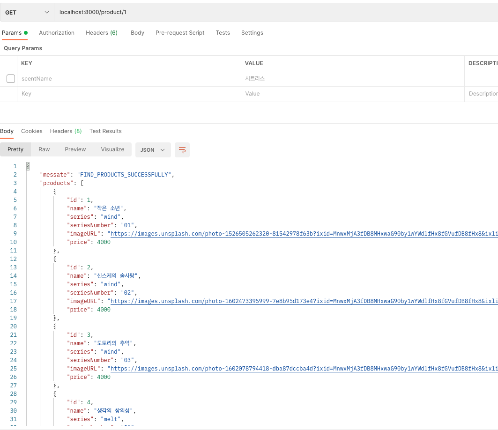
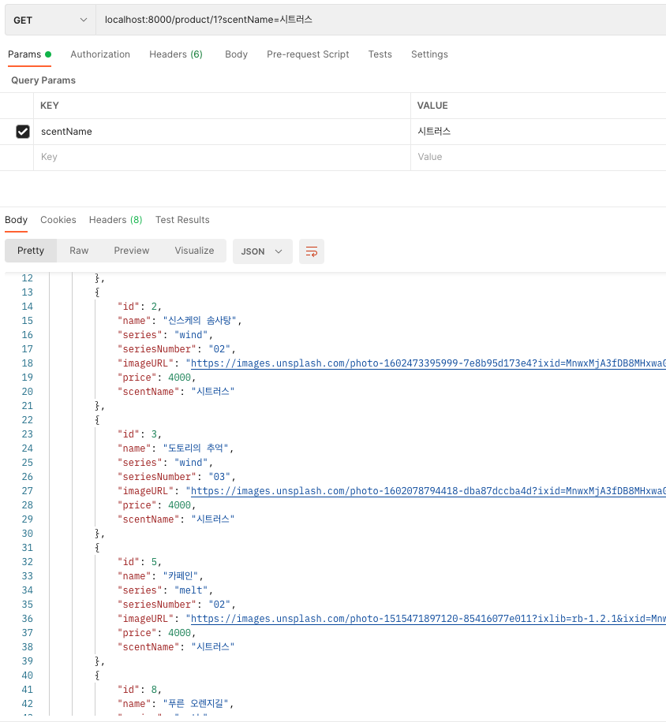

이전에 했던 BASENOTE 프로젝트에서 구현하지 못했던 필터링 기능을 시간이 나는 김에 한번 구현을 해보자고 결심을 했다.

[(참고로 이건 BASENOTE 프로젝트 이후에 작성한 회고록><)](https://undefinedp.github.io/회고/BASENOTE/)

[⚡️ GITHUB ](https://github.com/undefinedP/fullstack1-1st-BaseNote-backend)

<br/>

### ❗️이번에 코드를 작성하면서 고려한 것

1. 이전에 작성한 코드를 갈아엎는 것을 최대한 줄이기.

2. 중복되는 코드를 줄이기 → 결론적으로 말하자면..반 성공 반 실패인거같다. 분명히 더 나은 방법이 있을텐데...🤔

<br/>

일단 앞선 회고에서 내가 의미있는 코드라고 냅다 적었던 [KEY ERROR을 띄우는 코드는...](https://undefinedp.github.io/%ED%9A%8C%EA%B3%A0/BASENOTE/#%EB%BF%8C%EB%93%AF%ED%96%88%EB%8D%98-%EC%BD%94%EB%93%9C)정말로 "KEY ERROR"을 띄우는게 아니라 그냥 인풋에 공백이 들어왔을 때를 판단해서 에러를 띄우는 코드였다. 그런데 `KEY_ERROR`라는건 클라이언트 측에서 정보가 넘어올 때 정보의 인풋이 아무것도 없을 때에 뿌려줬어야 하는 것..! 두둥... 그래서 코드를 다시 새롭게 바꾸어 보았다


얘랑 똑같았다. 내가 해야했던건 NULL에 대한 에러 핸들링이었지만 여태까지 0에 대한 에러 핸들링을 하고있었으니..그래 그렇게 됐다

어쨌든 이게 바꾼 코드!

```javascript
const signUp = async (req, res) => {
  try {
    const { name, email, userAccount, phoneNumber, password } = req.body

    const requiredKeys = [
      'name',
      'email',
      'userAccount',
      'phoneNumber',
      'password',
    ]

    for (let key of requiredKeys) {
      if (!req.body[key]) {
        let err = new Error(`KEY_ERROR: ${key}`)
        err.statusCode = 400
        throw err
      }
    }

    await UserService.signUp(name, email, userAccount, phoneNumber, password)

    res.status(201).json({ message: 'SIGNUP_SUCCESS', email })
  } catch (err) {
    res.status(err.statusCode || 500).json({ message: err.message })
  }
}
```

회원가입을 할 때 반드시 넘겨받아야 하는 key들을 `requiredKeys`라는 배열에 담고, `for...of`를 돌린다. 만약에 req.body로 받은 값 중에 하나가 undefined라면 그에 해당하는 키에러를 뿌린다.

필수값들을 다 받아오면 DB에 저장을 하고, 201을 response로 클라이언트에 보내준다!

`for...of`도 참 요상한 친구라서 따로 정리를 해야겠다.

<br/>

### 🥴 얼레벌레 필터링 구현

[위에서](https://undefinedp.github.io/%ED%9A%8C%EA%B3%A0/BASENOTE-REF/#%EC%9D%B4%EB%B2%88%EC%97%90-%EC%BD%94%EB%93%9C%EB%A5%BC-%EC%9E%91%EC%84%B1%ED%95%98%EB%A9%B4%EC%84%9C-%EA%B3%A0%EB%A0%A4%ED%95%9C-%EA%B2%83) 쓴것과 마찬가지로 필터링 기능을 구현할 때 중복되는 코드를 줄이는 것이 목표 중 하나였다.

이미 이전에 작성한 코드가 2.5ml와 40ml에 따라 다른 데이터를 클라이언트한테 보내야했기 때문에 `Path Variable`을 사용해서 용량의 아이디를 변수로 사용해서 경로를 지정해놓았다. 그 상태에서 짜놓은 SQL문에 필터링 기능을 추가하기 위해서 이런 저런 방법을 해 보았지만 이게 원래 안되는건지..역량 부족인지...(역량 부족인듯) 결국 코드를 중복시키고 말았다 젠장야로~~

```sql
const findProducts = async (volume) => {
  return prisma.$queryRaw(`
    SELECT
      products.id,
      products.name,
      series.name as series,
      products.series_number as seriesNumber,
      images.image_url as imageURL,
      volumes.price
    FROM products
      JOIN products_volume
        ON products.id = products_volume.product_id
      JOIN volumes
        ON volumes.id = products_volume.volume_id
      JOIN series
        ON series.id = products.series_id
      JOIN images
        ON images.product_id = products.id
    WHERE volumes.volume_ml = '${volume}';
  `)
}
```

처음에는 위에서 설명한대로 volume을 변수에 담아주었다. 그리고 단순하게 뒤에 그냥 상품의 향을 변수로 담아서 query parameter로 넘기면 되겠구나! 라고 생각을 했는데 어림도 없지!

간과한게 하나 있었는데, query parameter로 상품의 향이 아무것도 넘어오지 않는다면 그냥 전체 상품에 대한 데이터를 뿌려줬어야했던 것...! 아무리 저 sql문에서 휘뚜루마뚜루 추가를 해보고 고쳐봐도 빈 배열을 뿌려주는 야속한 상황이 일어났고...ㅜ 결국에는 query parameter을 사용하는 로직을 따로 분리를 해주었다.

```sql
const findProducts = async (volumeId, scentName) => {
  return prisma.$queryRaw(`
  SELECT
        products.id,
        products.name,
        series.name as series,
        products.series_number as seriesNumber,
        images.image_url as imageURL,
        volumes.price,
        scents.name as scentName
    FROM products
        JOIN products_volume
          ON products.id = products_volume.product_id
        JOIN volumes
          ON volumes.id = products_volume.volume_id
        JOIN series
          ON series.id = products.series_id
        JOIN images
          ON images.product_id = products.id
        JOIN scent_products
          ON products.id = scent_products.product_id
        JOIN scents
          ON scents.id = scent_products.scent_id
    WHERE volumes.id = ${volumeId} AND scents.name
        LIKE concat ('%', '${scentName}', '%')
    GROUP BY products.name
    ORDER BY id
  `);
};
```

이렇게!

일단 향의 이름을 출력해줘야하기 때문에 위의 로직과는 다르게 `scents.name`을 추가해주었다. 그리고 `WHERE`문에 volumeId(용량)과 향의 이름을 변수로 지정을 해서, 두 가지를 다 클라이언트측에서 받아와야지만 데이터를 출력할 수 있는 형태로 sql을 수정해주었다.

Query parameter로 라우팅 처리를 하기로 했고, 문자열로 주고받을 수 있도록 하는게 직관적일 것 같다고 판단을 해서 문자열이 일치하는지를 검색할 수 있는 `LIKE`메서드를 사용하기로 했다. 일부 문자가 아니라 모든 문자를 사용할 것이기 때문에 앞뒤로 `%`를 사용해주었다.

concat은... 지금 보니 필요없다고 판단이 된다. 두 개의 문자열을 연결할 필요가 없기 때문에..! 봐도봐도 고칠 게 나오다니 정말 대단해


또 필터링을 할 때 순서가 랜덤으로 뽑히는 사태가 일어났다. `ORDER BY`를 추가해서 id순으로 정렬이 되서 나올 수 있게 수정해주면 깔-끔!


전체 product를 볼 때

<br/>


향 이름으로 필터링을 걸었을 때

<br/>

이렇게! 필터링이 원활하게 작동되는 것을 확인할 수 있다!

<br/>

### 😎 필터링 다 했니? 이제 에러 핸들링 가보자고

클라이언트가 용량의 아이디를 넣어야 하는 곳에 이상한 숫자를 넣거나, 없는 향을 요청을 보내면 안되기 때문에 이에 대한 에러 처리를 해주어야 했다.
<br/>

```javascript
const filter = await ProductService.findProducts(volumeId, scentName)

if ((volumeId < 3 && volumeId >= 1) === false) {
  err = new Error('INVALID_ACCESS')
  err.statusCode = 400
  throw err
}
if (!scentName) {
  const products = await ProductService.findAllProducts(volumeId)

  return res
    .status(200)
    .json({ messate: 'FIND_PRODUCTS_SUCCESSFULLY', products })
}

if (filter.length === 0) {
  err = new Error('INVALID_SCENT_NAME')
  err.statusCode = 400
  throw err
}

res.status(200).json({ message: 'FILTER_PRODUCTS_SUCCESSFULLY', filter })
```

`if...else`를 남발하고 싶지 않아서 고민을 좀 했다 우짜지...어떻게 해야 가독성이 좋아지지...그러다가 [이런 방법](https://eblo.tistory.com/7)을 발견했다. **Gateway style**을 도입을 해도 괜찮을 것 같아서 한번?도입을?해?보았다.

난 Gateway style을 속된말로 *입구컷 시킨다*라고 받아들였다. 예를 들어서 고급 레스토랑에 저녁 먹으러 갔는데 슬리퍼에 청바지 입었다고 입장하실 수 없습니다...라고 하는 덩치 큰 가드 아저씨가 나오고... 뭐 그런 미드에나 나올법한 장면이라고 해야하나.

서비스적인 입장에서 생각을 해 보았을때 보통 사람들은

1. 용량에 따라 먼저 선택을 한다
2. 좋아하는 향을 필터링하기 위해서 클릭을 한다
3. 그 다음에는 그 필터를 제거하기 위해서 또 클릭을 할 수도 있고, 안 할 수도 있다

이런 흐름으로 진행이 될 것이라고 생각했다. 그래서 조건문도 순서대로 걸어주었 *(입구컷을 시켰)*다.

1. 지정해놓은 용량의 id에서 벗어날 시에 에러를 던진다
2. 향의 이름이 undefined일 때, 전체 상품의 데이터를 뿌려준다
3. DB에 없는 향의 이름으로 접근을 하려고 할 시에 에러를 던진다.
4. 올바르게 접근을 할 시, 해당하는 향을 가지고 있는 상품만 출력을 한다.

의외로 막혔던게 `statusCode`를 설정하는 부분이었다. 400을 할까.. 404를 할까 고민을 많이 했는데 애초에 클라이언트가 리퀘스트를 잘못 보내서 발생하는 에러이기 때문에 400으로 설정을 했다.

<br/>

### 🔎 과정을 다시 돌아보면서

정말 믿을 수가 없다...엥 구라치지 마세요;
엄청난 시행착오를 겪어서 나온게 저런 코드라니? 심지어 중복이 엄청나게 되는!!! 코드라니?!! 그런데 SQL문으로 작성을 해서 저렇게 중복이 나오게 되는건지, 아니면 ORM으로 작성을 했을 때도 저렇게 중복해서 나오게 되는건지는 더 테스트를 해보아야 할 것 같다.

분명히 더 나은 방법이 있을거다. 근데 그걸 내가 모르는 것 뿐...딱 대 나오기만 해봐 내가 어떻게든 나오게 한다...점점 오기가 생기는 이 기분 짜릿하네..어 나 이런거 좋아했네...?

저번에도 한달 지나면 리팩토링할게 산처럼 많아질 것 같다는 뉘앙스로 적었던적이 있는데 역시나 아니나 다를까 그 말이 맞았다. 또 다음달에 보면 아니 뭔 코드를 이렇게 짰냐;;하면서 뜯어고치는건 아닌가 몰라?

다음달의 내가 엥,,코드 왜 이래,,라고 말하기 전에 '아~ 이래서 이렇게 썼구나~'라고 알 수 있게 적어봤다.
이 코드가...! 다음달의 내가 봐도 납득할 수 있는 코드였으면 좋겠다 ..! 물론 아니어도 상관은 없음 그만큰 내가 더 많이 알았다는거니까😉
