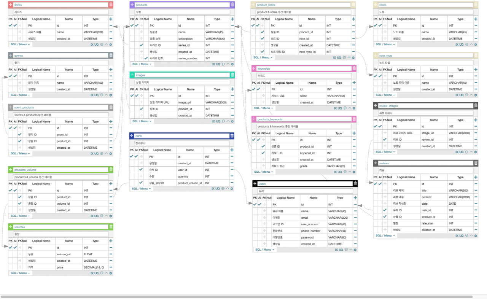

### PAFFEM 사이트 클론코딩

> **Find Your Scent, 가장 나다운 향을 찾아드립니다**

프로젝트 기간 : 0705 ~ 0723  
 (리팩토링 기간 일주일을 합해서 총 3주)  
 [FE Github](https://github.com/wecode-bootcamp-korea/fullstack1-1st-BaseNote-frontend)  
 [BE Github](https://github.com/wecode-bootcamp-korea/fullstack1-1st-BaseNote-backend)

#### 내가 맡은 역할✨

> **FE**

- 상품 리스트 페이지를 반응형으로 구현

- fetch를 이용해 백엔드와 통신해서 데이터 렌더링

- 받아온 데이터를 id순으로 가공한 뒤에 정렬

- react-router을 이용해 상품 용량에 따른 동적 라우팅 구현

> **BE**

- Aquery Tool을 활용해 ERD 작성

- Prisma를 사용해 MySQL DB 모델을 작성

- Layerd-Pattern을 사용해 코드를 작성

- JWT를 이용해 인증 및 인가 구현

- 이미 존재하는 유저 아이디로 가입을 시도했을 때 에러를 출력

#### 사용 스택💻

- React, React-Router, Sass, ES6
- Node.js, Express, Prisma, Mysql, Bcrypt, JWT, Babel
- Git, ESLint, Prettier

#### 협업툴🛠

- Trello
- Slack
- Github

---

#### **첫 프로젝트**

처음에는 우리팀 모두가 의욕이 앞섰고, 꼭 구현하고 싶은 리스트가 점점 .. 늘어났다. 처음에 멘토님들이 보고 기겁을 하셨던 그 순간 .. 잊을 수 없어요 ... 물론 그때도 우리끼리 아 절반은 절!딴! 당할 생각으로 적었습니다. 하면서 당당하기 말은 했지만...ㅎ...그래도 많긴 했습니다 그쵸...?

프로젝트를 진행하면서 정말 내가 아직 많이 모자라구나 나는 그냥 말하는 감자구나를 다시금 느꼈다. 아 이거 당연히 아는건데 하는것도 막상 코드를 짜다보면 모르겠고 에러 터지면 뇌정지 오고 ... 다른 사람들은 이렇게 잘하는거 나는 왜 못하지? 자괴감에 빠지고 그냥 아주 구렁텅이가 따로 없었다. 진척없는 내 코드를 들여다보면 그냥 한숨만 나오고...근데 뭐 어떡해 이겨내야지 아좌좍. 하면서 했더니 뭐가 되긴 됐다. 얼레벌레.. 얼렁뚱땅 .. 일단 돌아만 가면 된다! 리팩토링 하면 된다!! 이 마음으로 진행했더니 무언가가 나오긴 나왔다.

백엔드랑 프론트랑 통신 성공했을 때의 그 짜릿함 포스트맨에서 돌렸을때 예쁘게 뽑히던 데이터를 보면서 악!!! 야밤에 소리도 질러보고 모니터 붙잡고 울어도 보고 뭐 하나 성공하면 위워크고인물팀(라고제멋대로정해버리기~ㅎ)민성님과 수호님에게 냅다 달려가서 자랑도 갈겨보고...너무 힘들고 즐거웠던 프로젝트 기간...다른분들은 어떠셨을지 모르겠지만 저는... 여러분들과 한 팀이 되어서 너무 행복했습니다........베이스노트팀 최고

#### **천리길도 모델링부터**


_~~정답! 다대다 지옥!~~_

null값이 거의 존재하지 않는 다대다 테이블에 데이터는 어떻게 그렇게 많은지.... csv 일일히 입력한다고 민성님과 하영님이 정말 너무 많은 고생을 하셔서 ....

저기서 제일 골때리는 파트가 Product 테이블과 Note를 연결하는 테이블이었다. 한 상품은 많은 노트를 가지고, 또 그 많은 노트들이 탑, 미들, 베이스노트로 분류가 되어있었는데 저 테이블을 도대체 어떻게 짜야할지 몰라서 엄청난 토의가 이뤄졌던 기억이 난다 ...

결국에는 노트를 담는 Notes테이블과 탑, 미들, 베이스노트를 담는 Note_Types라는 테이블로 나눈 뒤에, Products와 저 두 테이블을 묶는 중간테이블을 만들어줌으로서 해결했다! 중간테이블에는 한 쌍의 테이블로만 매칭이 가능하다고만 생각을 했어서 엄청나게 충격을 받았었다 진짜로... 심오하고 재밌는 테이블의 세계

#### **여자는 태어나서 세번 운다 첫번째는 태어나서 울고 두번째는 우리팀 우승했을 때 세번째는 ...**

Git 오류때문에 운다 .........프로젝트 기간중에 내내 git 오류와 맞다이를 깠다. 아주 제대로 .. 그리고 내가 이겼음 당연함 이 멍청한 컴퓨터자식ㅋ 덕분에 에러창이 떠도 두려워하지 않는 강철멘탈을 얻었습니다 후 .. 너 이자식 ...

이번에 터진 오류를 보면서 느낀 세 가지

1.  커밋은 자주 자주 남기자 커밋만이 살길이다
2.  커밋만이 살길이다
3.  커밋만이 ...

merge나 push를 아주 제대로 잘못해서 폴더가 터져도 꼼꼼한 커밋 하나만 있다면 든든하다는걸 아주 뼈저리게 느꼈다. 눈물 흘리면서 git reset hard 눌렀을 때 ... 내 작업물 와르르 날라갈 때 ... (더보기)

어쨌든 이런 피같은 경험으로 다시는 실수하지 않기로 해 꼬옥 약속... 언젠가는 날잡아서 git command 정리해야지


#### **하드코딩 지양하고 예쁜 코드 되찾자**

정말 '돌아가게만' 코드를 짜놨었기때문에 하드코딩으로 해놓은게 몇가지가 있었고 리팩토링 기간중에 수정을 했다. 생각보다 머리를 조금 써야하는 것도 있었고, 엥 왜 이 생각을 못했지? 하면서 코드 한줄만 띡 바꿔줘도 되는 애가 있었다.

당장 저번주에 짠 코드를 보면서 나... 왜 코드 이렇게 짰지...? 하고 있었는데 또 한 달 뒤에 보면 와 진짜 코드 왜 이렇게 짰지...? 이러고 있을 것이 분명하다. 봐도봐도 새롭다. 리팩토링으로 깔끔-예쁨-정갈해지는 코드를 보면서 그냥 짠다고 대수가 아니라 수정하는 것도 굉장히 굉장히 중요하다는걸 다시 한번 깨달았다.

내 코드는 완벽하지 않다. 그렇지만 완벽해질 수 있을 때 까지 수정은 할 수 있다!! 처음부터 코드를 예쁘게 짜려고 하는 것도 물론 중요하지만, 그보다는 나중에 수정할 때에 있어서 내가 무슨 의도로 저렇게 코드를 짜놨는지 파악하고, 그걸 다시 리팩토링을 하는 것도 굉장히 중요하다는 것을 깨우쳤다.

#### **뿌듯했던 코드**

```javascript
const signUp = async (req, res) => {
  try {
    const { name, email, userAccount, phoneNumber, password } = req.body

    const values = Object.values(req.body)
    const keys = Object.keys(req.body)

    const result = keys.filter(key => {
      return req.body[key] === ''
    })

    if (values.includes('')) {
      let err = new Error(`KEY_ERROR: ${result}`)
      err.statusCode = 400
      throw err
    } else {
      await UserService.signUp(name, email, userAccount, phoneNumber, password)

      res.status(201).json({ message: 'WELCOME', userAccount })
    }
  } catch (err) {
    res.status(err.statusCode || 500).json({ message: err.message })
  }
}
```

회원가입을 할 때 하나라도 입력을 하지 않으면 error을 띄우는 Error Handling 부분에서의 코드이다!  
 처음에는 냅다 if else를 조건 하나하나마다 다 부여를 했고, 결과적으로는 가독성이 너무 구리고 중복되는 함수가 많아진

~개쓰레기 코드~

가 나왔다.


~개트뤠시코드~

주어진 임무는

> 중복되는 코드를 삭제하기  
> 만약에 하나라도 입력을 하지 않았을 때 바로 key error을 쏴주기

였다.

그래서 결국은 필요한 key와 value값을 Object.keys와 Object.values 메서드를 사용해서 배열로 바꾸고 ⟶ 바꾼 배열 안에서 key에 해당하는 value값이 비었을 경우에 그 key를 return을 시켜서 result에 담았다!

저 짧은 몇줄을 쓰는데 ... 눈물을 빠악빠악 흘리면서 ..... 따흐흐흑... 하지만 완성하고보니? 너무 깔끔하고 예쁜 코드가 짜라란 하고 나왔다.  
 일일히 if else문을 사용하지 않아도 되고, error을 던질 때도 그냥 result값을 변수로 띄워주면 value값이 없는 키값을 알아서 띄워주게 된다. 너무 편해... 너무 최고야 ...

그리고 Object.values, Object.keys의 중복을 줄이기 위해서 얘도 변수로 선언을 해주었더니 두배로 깔끔한 코드가 나오게 되었다. 짜릿해...이게.. 클린코드의 맛...?

#### **아쉬웠던 점**

해보고 싶었던, 목표로 했던 기능들을 결국에는 다 구현하지 못했다.  
 생각보다 2주는 너무 촉박한 시간이었다...! 진짜로 누가 내 시간 막 돌리냐 하늘에다가 대고 구라지 거짓말이지를 냅다 외치고싶었던 적이 한두번이 아니다.

일의 우선순위를 고려하지 못했다.  
 페이지 구현에 있어서 중요도를 나눈 뒤에 일을 진행울 했어야 했는데 초반부터 그러지 못한 점이 너무 아쉬웠다. 그래도 중간 발표 이후에는 어느정도 가닥을 잡고나서 팀원들끼리 다같이 의견을 나눠서 일을 진행을 했지만 초반부터 했으면 훨씬 더 효율이 좋았을 것 같기도 하다.

내 실력  
 뼈저리게 느꼈다. 나 진짜 아무것도 모르는구나 ... 위에도 말했지만 정말 한계를 많이 느낀 시간이었고 .. 그만큼 해결했을 때의 성취감은 오백배였지만 고통도 오백배였다. 이건 그냥 철저하게 내 노력으로 이기는 수 밖에 없는 것 같다!!!!@!! 빠이텡!!!!!!!!


---

**내가 500번 들은 노동요**

[Levitating](https://youtu.be/WHuBW3qKm9g)  
 [heaven](https://youtu.be/NfdYhJ1Xpro)
